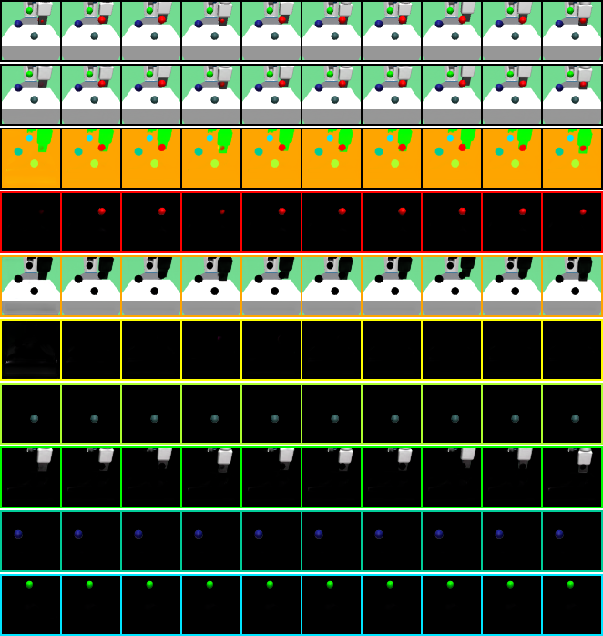
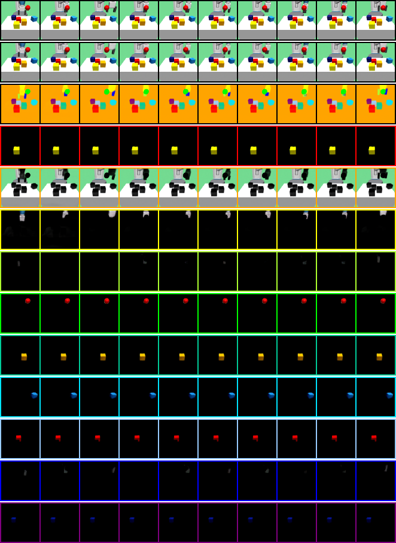
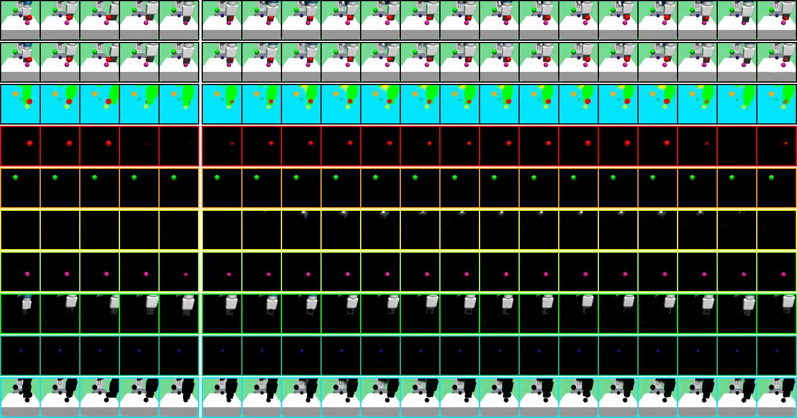
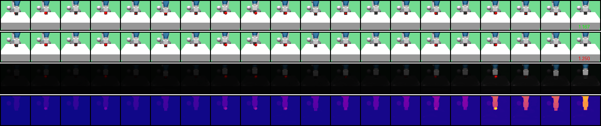

# SOLD: Slot-Attention for Object-centric Latent Dynamics

**[AIS, University of Bonn](https://www.ais.uni-bonn.de/index.html)**

[Malte Mosbach](https://maltemosbach.github.io/)&ast;, [Jan Niklas Ewertz]()&ast;, [Angel Villar-Corrales](http://angelvillarcorrales.com/templates/home.php), [Sven Behnke](https://www.ais.uni-bonn.de/behnke/)

[[`Paper`](https://arxiv.org/abs/2410.08822)] &nbsp; [[`Website`](https://slot-latent-dynamics.github.io/)] &nbsp; [[`BibTeX`](https://slot-latent-dynamics.github.io/bibtex.txt)]

**Slot-Attention for Object-centric Latent Dynamics (SOLD)** is a model-based reinforcement learning algorithm operating on a structured latent representation in its world model.


[//]: # (<br/>)

## Getting started
### Docker
We provide a [`Dockerfile`](docker/Dockerfile) for easy installation via:
```bash
cd docker && docker build -t <user>/sold:1.0.0 .
```
### Manual Installation
Alternatively, you can follow the instructions to install the dependencies manually.
Start by installing the [multi-object-fetch](https://github.com/maltemosbach/multi-object-fetch) environment suite.
Then add the SOLD dependencies to the conda environment:
```bash
conda env update --file docker/conda_env.yml
```


## Training
The training routine consists of two distinct steps: [pre-training a SAVi model](#pre-training-a-savi-model) and 
[training a SOLD model](#training-a-sold-model) on top of it.

### Pre-training a SAVi model
SAVi models are pre-trained on static datasets of random trajectories. 
Such datasets can be generated using the following script:
```bash
python generate_dataset.py experiment=my_dataset env.name=finger-spin
```

To train a SAVi model, specify the dataset to be trained on and model parameters such as the number of slots in [`train_savi.yaml`](./sold/configs/train_savi.yaml) and run:
```bash
python train_savi.py experiment=my_savi_model
```

<details>
    <summary> **Show sample pre-training results** </summary>
    Good SAVi models should learn to split the scene into meaningful objects and keep slots assigned to the same object over time.
    Examples of SAVi models pre-trained for a reaching and picking task are shown below.
     
</details>


### Training a SOLD model

To train SOLD, a checkpoint path to the pre-trained SAVi model is required, which can be specified in the [`train_sold.yaml`](./sold/configs/train_sold.yaml) configuration file.
Then, to start the training, run:
```bash
python train_sold.py
```
All results are stored in the [`experiments`](./experiments) directory.


<details>
    <summary> **Show sample training outputs** </summary>
    When training a SOLD model, you can check different visualisations to monitor the training progress. 
    The *dynamics_prediction* plot highlights the differences between the ground truth and the predicted future states, and 
    shows the forward prediction of each slot.
    <p align="center">
      
    </p>
    In addition, visualisations of *actor_attention* or *reward_predictor_attention*, as shown below, can be used to 
    understand what the model is paying attention to when predicting the current reward, i.e. which elements of the scene 
    the model considers to be reward-predictive.
    <p align="center">
      
    </p>
</details>


For further evaluation of a trained model or a set of models in a directory, you can run:
```bash
python evaluate_sold.py checkpoint_path=PATH_TO_CHECKPOINT(S)
```
which will create metrics and visualizations for the checkpoints.

## Checkpoints
We added pre-trained SAVi and SOLD models in the [`checkpoints`](./checkpoints) directory.

## MuJoCo

The PyTorch MuJoCo guide gives
```bash
conda install -c conda-forge xorg-libx11
```
as the solution to the error
```bash
fatal error: X11/Xlib.h: No such file or directory
   | #include <X11/Xlib.h>
   |          ^~~~~~~~~~~~
```

but I found
```bash
conda install -c conda-forge xorg-xorgproto
```
to fix the error instead.