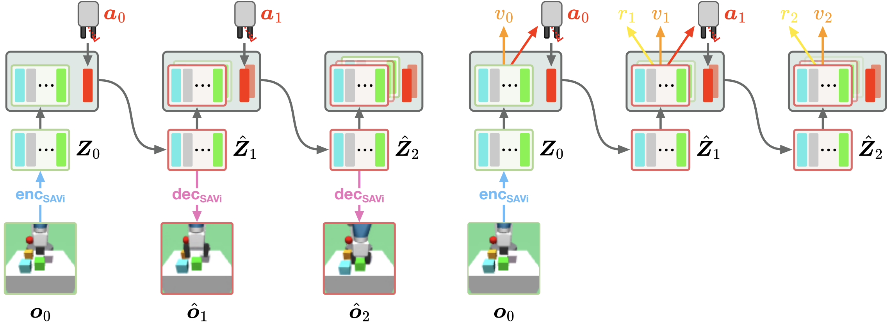
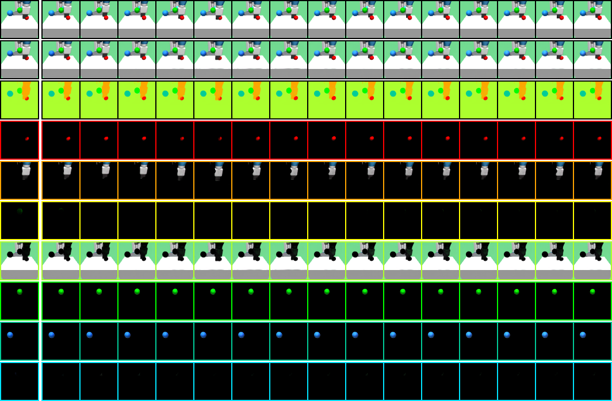

# SOLD: Slot-Attention for Object-centric Latent Dynamics

**[AIS, University of Bonn](https://www.ais.uni-bonn.de/index.html)**

[Malte Mosbach](https://maltemosbach.github.io/)&ast;, [Jan Niklas Ewertz]()&ast;, [Angel Villar-Corrales](http://angelvillarcorrales.com/templates/home.php), [Sven Behnke](https://www.ais.uni-bonn.de/behnke/)

[[`Paper`](https://arxiv.org/abs/2410.08822)] &nbsp; [[`Website`](https://slot-latent-dynamics.github.io/)] &nbsp; [[`BibTeX`](https://slot-latent-dynamics.github.io/bibtex.txt)]

**Slot-Attention for Object-centric Latent Dynamics (SOLD)** is a model-based reinforcement learning algorithm operating on a structured latent representation in its world model.




[//]: # (<br/>)

## Getting started
Begin by installing the [multi-object-fetch](https://github.com/maltemosbach/multi-object-fetch) environment suite.
Thereafter, in the same conda environment, install SOLD and its dependencies:
```bash
pip install -e .
```


## Training

First to pre-train a SAVi model, run:
```bash
python training/train_savi.py experiment.name=my_exp
```

Then, to train the SOLD model, run:
```bash
python training/train_sold.py
```

The results are stored in the [`experiments`](./experiments) directory.


## Checkpoints
We added pre-trained SAVi and SOLD models in the [`checkpoints`](./checkpoints) directory.

